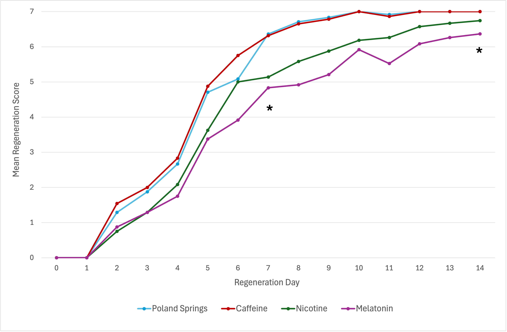

# Planarian Regeneration Analysis: Effects of Caffeine and Nicotine
## Overview
Quantitive analysis of regeneration patterns in *Dugesia dorotocephela* planarians under different chemical treatments. This project examines how caffeine and nicotine exposure affects regeneration rates and morphological development over a 14-day period in three trials completed over the course of 6 weeks.

**Research conducted as a part of BIOL 2309 (Biology Project Lab) at Northeastern University, Fall 2025.**

---

## Research Question
How do caffeine and nicotine affect regeneration rates, morphological development, and overall regeneration success in planarian flatworms.

---

## Methods

### Experimental Design
- **Organism:** *Dugesia dorotochephala* (brown planarians)
- **Study Duration:** 3 14-day trials across 6 weeks
- **Sample Size:** 36 planarians in each of 4 treatment groups (144 total planarians used for data collection)
- **Treratment Groups:**
  - Positive control (Poland Springs water)
  - Melatonin - Negative control (0.25 mM)
  - Caffeine treatment (0.25 mM)
  - Nicotine treatment (0.25 mM)

### Data Collection
- Morphological scoring using standardized criteria from 7-stage scale completed every 1-2 days with the exception of weekends when lab was closed
- Assessment of regeneration stages: blastema formation, eyespot development, pharynx regeneration
- Photographic documentation of regeneration progress

### Statistical Analysis
- Kruskal-Wallis H-test for non-parametric comparison across treatment groups
- Post-hoc pairwise comparisons where significant differences detected
- Significance level: a = 0.05

---

## Key Findings

- Caffeine treatment showed no statistical significance to imply improvement on overall regenerative abilities
  - Trend observed suggested potential positive affect on early stages of regeneration
- Nicotine exposure resulted in no statistical significane, however slightly aligned with initial hypotheses given modest observable trend suggests nicotine has a negative affect on regeneration
- Melatonin as negative control, while not quite statistically significant, showed large negative effect on planarian regeneration and increased mortality rates
- Statistical analysis of overall regeneration was performed using Kruskal-Wallis test and did not indicate statistical significance (p = 0.189)


*Figure 1: Mean regeneration scores across treatment groups over 14 days. Lines represent mean values for each treatment condition. Asterisks indicate timepoints where greatest significance was observed.*

___

## Repository Structure

```
planarian-regeneration-analysis/
|- README.md                        # This file
|- data/
|  |- raw_data.csv                  # Original experimental data
|  |_ processed_data.csv            # Cleaned data for analysis
|- notebooks/
|  |- 01_data_cleaning.ipynb        # Data preprocessing
|  |- 02_exporator_analysis.ipynb   # Initial exploration and visualization
|  |_ 03_statistical_analysis.ipynb # Kruskal-Wallis tests and results
|- figures/
|  |_ [visualization outputs]       # Publication-quality plots
|_ requirements.txt                 # Python packages needed
```

---

## Technologies Used

- **Python 3.12.3**
- **pandas** - data manipulation and cleaning
- **numpy** - numerical operations
- **scipy** - statistical testing (Kruskal-Wallis)
- **matplotlib & seaborn** - data visualization
- **Jupyter Notebook** - interactive analysis

---

## How to Run This Analysis

### Prerequisites
- Python 3.8 or higher
- Jupyter Notebook

### Setup
1. Clone this repository:
'''
bash
git clone https://github.com/madisoncollins/planarian-regeneration-analysis.git
cd planarian-regeneration-analysis
'''

2. Install required packages:
''' bash
pip install -r requirements.txt
'''

3. Launch Jupyter Notebook:
''' bash
jupyter notebook
'''

4. Open and run notebooks in order:
   - '01_data_cleaning.ipynb'
   - '02_exploratory_analysis.ipynb'
   - '03_statistical_analysis.ipynb'

---

## Future Directions
- Investigating the combined effects of caffeine and nicotine on regeneration
- Examining whether genetic or pharmacological manipulation of adenosine or nAChR signaling pathways can mimic or prevent the effects of caffeine and nicotine
- Understanding how common neuroactive compounds influence regeneration in planarians may have implications for regenerative medicine

--- Author

*** Madison Collins**
Northeastern University | B.S. Biology
Email: collins.madi@northeastern.edu
[LinkedIn](https://linkedin.com/in/madison-collins-865757348)

---

## Acknowledgements

This research was conducted as part of Biology Project Lab (BIOL 2309) at Northeastern University. Special thanks to Dr. Lindsay Mehrmanesh and my research team members for their collaboration on experimental design and data collection.

---

## Liscense

This project is available for educational purposes. Please cite if using for academic work.
